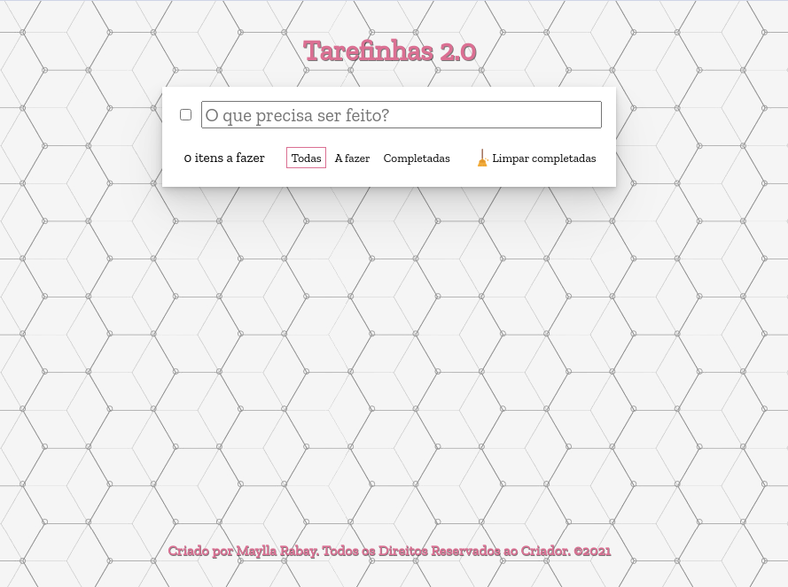

<h1 align="center">
  
</h1>

<h2 align="center"> 
	🚀 Tarefinhas 2.0 🚀
</h2>

## 💻 Sobre o projeto
  Um site para criar uma lista de tarefas, mais completo do que meu outro repositório de [tarefas](https://github.com/MayllaRabay/lista-tarefas). Feito para treinar meu conhecimento principalmente em Javascript e DOM (Document Object Model - graças à esse objeto, podemos acessar as propriedades dos elementos da página e interagir com eles). Temos as seguintes interações:
  - Criar uma tarefa
  - Excluir uma tarefa
  - Marcar tarefa como feita
  - Marcar e desmarcar todas as tarefas
  - Filtro de todas as tarefas 
  - Filtro de tarefas feitas
  - Filtro de tarefas a fazer
  - Excluir todas as tarefas feitas

## 🎨 Layout
  Design próprio, com imagens retiradas da internet e editadas no GIMP. 
  Ícones feitos pela [Freepik](https://www.freepik.com) e baixados na [Flaticon](https://www.flaticon.com/). Cores utilizadas:
  - white (branco)
  - palevioletred (rosa pálido)
  - rgb(206, 69, 115) (rosa mais escuro)

## 🛠 Tecnologias
  - 
  - 
  - 
  - 

## :bowtie: Autor

Feito com ❤️ por Maylla Rabay 👋 [Entre em contato!](https://www.linkedin.com/in/mayllarabay/)
